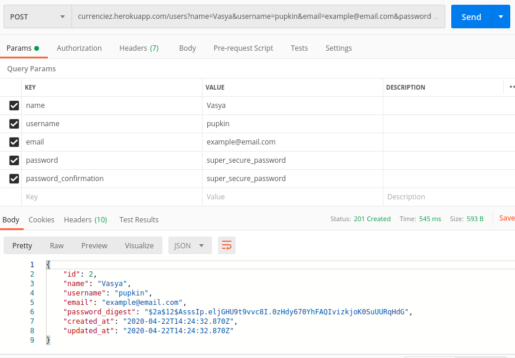
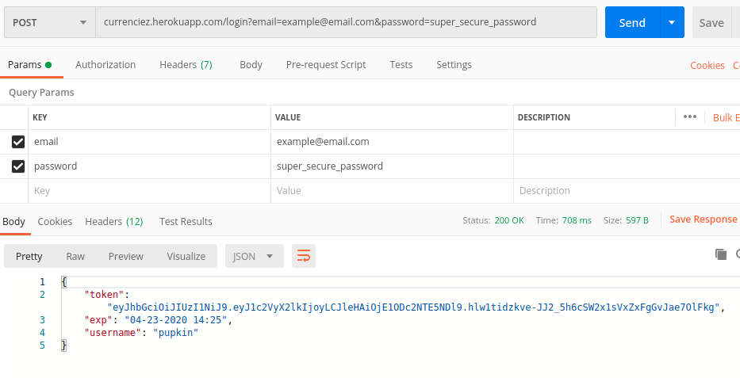
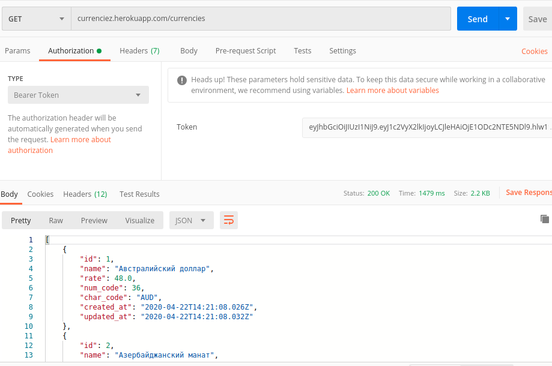
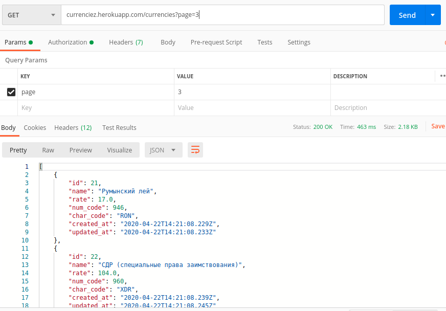
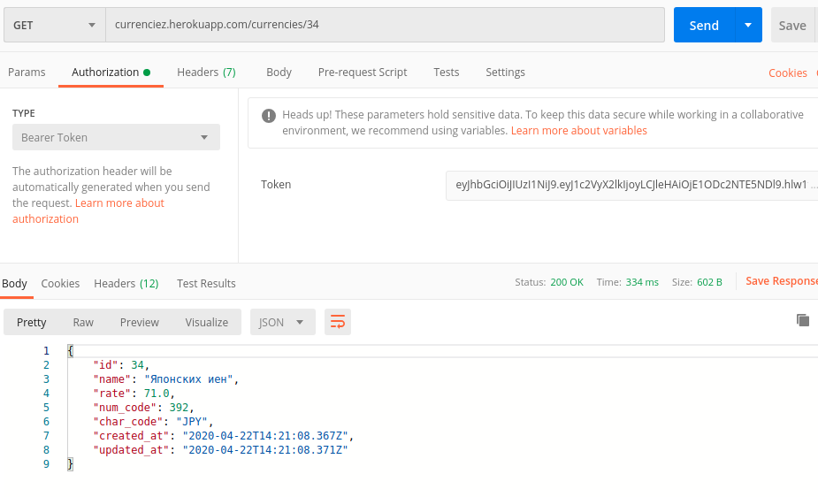

## Install and run 

``` bash
git clone git@github.com:rkislitsin/currenciez.git
```

``` bash
cd /currensiez
```

``` bash
bundle install
```

``` bash
rake db:create && rake db:migrate
```

``` bash
rake currencies:refresh
```

### Usage

 ##### create user
 

 ##### login user 


 ##### get currencies (by default returns first page with 10 currencies) 
 need to pass token returned on login


 ##### get currencies with specified page
 need to pass token returned on login


 ##### get currency by :id
 need to pass token returned on login

